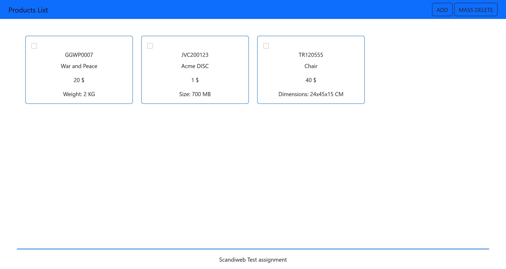
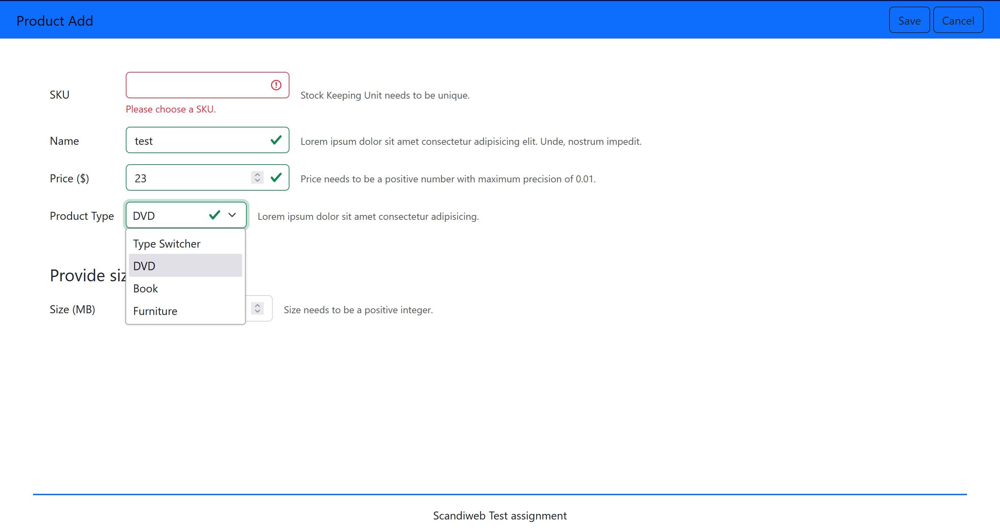

# MVC Product Listing

A simple product listing website built using the MVC pattern and PHP.

## Table of Contents

- [MVC Product Listing](#mvc-product-listing)
  - [Table of Contents](#table-of-contents)
  - [Technologies](#technologies)
  - [Features](#features)
  - [Local deployment](#local-deployment)
    - [Docker setup (Tested on _Windows 11_ with _WSL2_)](#docker-setup-tested-on-windows-11-with-wsl2)
    - [XAMPP setup on Windows](#xampp-setup-on-windows)
  - [Usage](#usage)
  - [Screenshots](#screenshots)
    - [Home page](#home-page)
    - [Add page](#add-page)

## Technologies

PHP, SQL, JavaScript, Bootstrap 5, Docker

## Features

- Product addition and removal
- Input validation (front-end and back-end)

## Local deployment

### Docker setup (Tested on _Windows 11_ with _WSL2_)

1. Run the `docker-compose` file using the following command:

```bash
docker-compose up
```

### XAMPP setup on Windows

1. Download and install **XAMPP** from https://www.apachefriends.org/

2. Clone the repository into the `xampp/htdocs` folder

3. Download and install **Composer** from https://getcomposer.org/

4. Open the project folder in the terminal and run **"composer update"**

5. Start **Apache** and **MySQL** from **XAMPP Control Panel**

## Usage

The website is accessible at <http://localhost:80>

## Screenshots

### Home page



### Add page


